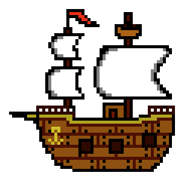

# Space-Ship
<!-- PROJECT SHIELDS -->
<!--
*** I'm using markdown "reference style" links for readability.
*** Reference links are enclosed in brackets [ ] instead of parentheses ( ).
*** See the bottom of this document for the declaration of the reference variables
*** for contributors-url, forks-url, etc. This is an optional, concise syntax you may use.
*** https://www.markdownguide.org/basic-syntax/#reference-style-links
-->
[![Contributors][contributors-shield]][contributors-url]
[![Forks][forks-shield]][forks-url]
[![Stargazers][stars-shield]][stars-url]
[![Issues][issues-shield]][issues-url]
[![MIT License][license-shield]][license-url]
[![LinkedIn][linkedin-shield]][linkedin-url]

<!-- PROJECT LOGO -->
 

  

2D physics game made over 48 hours for Weekly Game Jam 118 (weeklygamejam.com).
Theme: Spaceship.

## Getting Started

- Download: git clone https://github.com/naitsirkelo/GameJam118.git
- Play: Spaceship3D_real.exe
- Spaceship3D.exe has enhanced rocket power to reach the goal faster

## Built With

* [Unity](https://store.unity.com/download-nuo)

## Versioning

**v1.0.0**

## Authors

* **andmag98**
* **naitsirkelo**

## License

This project is licensed under the MIT License - see the [LICENSE.md](LICENSE.md) file for details
